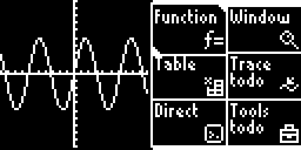
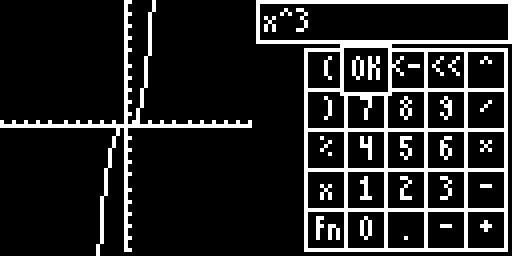
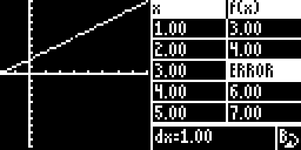

# Graph 2 (for the Arduboy)

A graphing calculator for your Arduboy!

# Features

Here's what's currently here:
* Simple keypad for entering numbers
* An RPN calculator
* Graph output
* Shunting-yard algorithm for converting user-readable functions.
* Formula keyboard
* Direct mode (enter formulas, get response)
* Table view

Here's what I hope to accomplish in the near future:
* Better error reporting
* Coherent UI
* Table "entry mode" and "jump to" setting.
* Settings (disable axis lines, dots instead of lines, DEG or RAD, etc.)

# Known Issues

Some issues are copied from [the Arduboy forum thread](https://community.arduboy.com/t/graph-2-graphing-calculator-for-arduboy-2/8304):
* ~~Division operations are reversed (Function-related issue)~~
* ~~Cursor soft-resets Arduboy when it goes offscreen on ~~main menu~~ RPN debug screen (GraphFont-related issue)~~
  * This is "solved" but the root issue is not solved.
* ~~Implicit Multiplication doesn't work (Function-related issue) - `2x`~~
* ~~Error reporting doesn't exist - functions fail silently (Function-related issue) - `x+`~~
  * Error reporting should happen in two stages -- one where the char string is being parsed, one where the function is being graphed. This would allow for syntax errors to be reported in a place nicer than the graph's draw function.
* ~~Graph object wastes a lot of memory by storing all Y values (Graph-related issue)~~
* Prepare for functions by converting existing char input system over to a token-based system (Big issue)
  * This means using a more TI-84-like system where there's a dedicated unary minus token and it's completely different from the subtraction token.
* Unary Negative doesn't work (Function-related issue) - `-5*x`
* Optimize more menus (draw only when you need to)
* There are a few todos hidden in the code.
* Why does `cursor.cpp` exist?

# Screenshots

I'm still working on parts of the UI!
* The window settings are next to recieve an overhaul. I'll add simple "nudge" and "zoom" controls and make the stuff there look better.
* The trace menu is very bare. Need to improve it too.
* Direct could look much much better. A scrolling display not unlike the TI-84 would be welcome.

Here's the menus that are already "done":

If you want to see where I started, check out [this Twitter thread](https://twitter.com/V360dev/status/1191078748256456706)!

# Credits

* Me - UI, RPN calculator, font
* SmileBASIC Discord - A lot of help with C++
* snail_ - Some help with the Shunting-Yard Algorithm
* yinkou - TinyFont code, used as base for GraphFont
